# 02 — Red Multisede con OSPF, VLANs y DHCP Centralizado


Laboratorio avanzado que simula una infraestructura empresarial real con 3 sedes (Madrid, Barcelona y Valencia) interconectadas mediante enlaces WAN Serial y routing dinámico OSPF. Cada sede tiene segmentación por VLANs con inter-VLAN routing, y un servidor DHCP centralizado en Madrid da servicio a todos los clientes de la red.

---

## Índice

- [Topología](#topología)
- [Dispositivos](#dispositivos)
- [Direccionamiento IP](#direccionamiento-ip)
- [Configuración](#configuración)
- [Verificación](#verificación)
- [Problemas encontrados](#problemas-encontrados)

---

## Topología

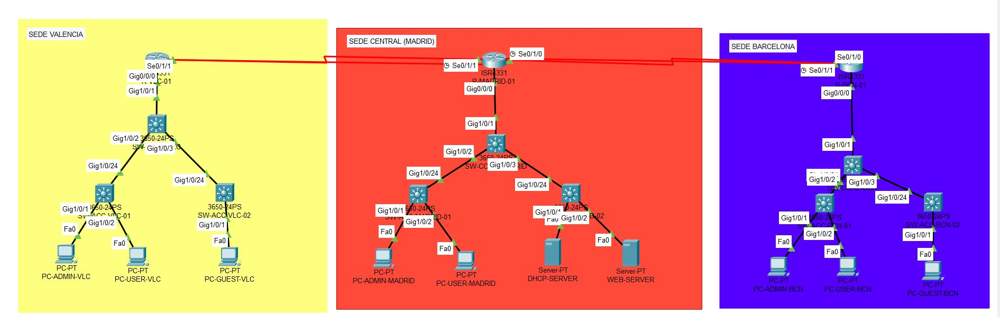

```
                    SEDE CENTRAL (MADRID)
                       R-MADRID-01
                      /            \
                Se0/1/0            Se0/1/1
               10.0.0.1            10.0.1.1
                  |                    |
               10.0.0.2            10.0.1.2
               Se0/1/0             Se0/1/0
            R-BCN-01               R-VLC-01
            Se0/1/1 ————————————— Se0/1/1
            10.0.2.1               10.0.2.2

Cada router conectado a su SW-CORE mediante Gi0/0/0 (trunk)
Cada SW-CORE conectado a 2 SW-ACC mediante Gi1/0/2 y Gi1/0/3
Uplink SW-ACC → SW-CORE en Gi1/0/24
```

---

## Dispositivos

| Dispositivo | Modelo | Sede | Función |
|---|---|---|---|
| R-MADRID-01 | Cisco ISR 4331 | Madrid | Router-on-a-stick, DHCP relay, OSPF |
| R-BCN-01 | Cisco ISR 4331 | Barcelona | Router-on-a-stick, DHCP relay, OSPF |
| R-VLC-01 | Cisco ISR 4331 | Valencia | Router-on-a-stick, DHCP relay, OSPF |
| SW-CORE-MADRID | Cisco 3650-24PS | Madrid | Switch core, enlaces trunk |
| SW-CORE-BCN | Cisco 3650-24PS | Barcelona | Switch core, enlaces trunk |
| SW-CORE-VLC | Cisco 3650-24PS | Valencia | Switch core, enlaces trunk |
| SW-ACC-MADRID-01 | Cisco 3650-24PS | Madrid | Acceso PCs VLAN 10 y 20 |
| SW-ACC-MADRID-02 | Cisco 3650-24PS | Madrid | Acceso servidores VLAN 30 |
| SW-ACC-BCN-01 | Cisco 3650-24PS | Barcelona | Acceso PCs VLAN 10 y 20 |
| SW-ACC-BCN-02 | Cisco 3650-24PS | Barcelona | Acceso PCs VLAN 40 |
| SW-ACC-VLC-01 | Cisco 3650-24PS | Valencia | Acceso PCs VLAN 10 y 20 |
| SW-ACC-VLC-02 | Cisco 3650-24PS | Valencia | Acceso PCs VLAN 40 |
| DHCP-SERVER | Server-PT | Madrid | Servidor DHCP centralizado |
| WEB-SERVER | Server-PT | Madrid | Servidor web |

---

## Direccionamiento IP

### Enlaces WAN Serial

| Enlace | Red | Router A | Router B |
|---|---|---|---|
| Madrid ↔ Barcelona | 10.0.0.0/30 | 10.0.0.1 (Se0/1/0) | 10.0.0.2 (Se0/1/0) |
| Madrid ↔ Valencia | 10.0.1.0/30 | 10.0.1.1 (Se0/1/1) | 10.0.1.2 (Se0/1/0) |
| Barcelona ↔ Valencia | 10.0.2.0/30 | 10.0.2.1 (Se0/1/1) | 10.0.2.2 (Se0/1/1) |

> Se usa /30 porque cada enlace punto a punto solo necesita 2 IPs útiles.

### VLANs por sede

| VLAN | Nombre | Madrid | Barcelona | Valencia |
|---|---|---|---|---|
| 10 | Admin | 192.168.10.0/24 | 192.168.50.0/24 | 192.168.90.0/24 |
| 20 | Users | 192.168.20.0/24 | 192.168.60.0/24 | 192.168.100.0/24 |
| 30 | Servers | 192.168.30.0/24 | 192.168.70.0/24 | 192.168.110.0/24 |
| 40 | Guests | 192.168.40.0/24 | 192.168.80.0/24 | 192.168.120.0/24 |

### Gateways por sede

| Sede | VLAN 10 GW | VLAN 20 GW | VLAN 30 GW | VLAN 40 GW |
|---|---|---|---|---|
| Madrid | 192.168.10.1 | 192.168.20.1 | 192.168.30.1 | 192.168.40.1 |
| Barcelona | 192.168.50.1 | 192.168.60.1 | 192.168.70.1 | 192.168.80.1 |
| Valencia | 192.168.90.1 | 192.168.100.1 | 192.168.110.1 | 192.168.120.1 |

### IPs estáticas

| Dispositivo | IP | VLAN |
|---|---|---|
| DHCP-SERVER | 192.168.30.10 | 30 |
| WEB-SERVER | 192.168.30.11 | 30 |

---

## Configuración

### 1. Interfaces WAN Serial y subinterfaces VLAN

> El módulo **NIM-2T** debe añadirse a cada ISR 4331 antes de encenderlo (pestaña Physical → apagar → arrastrar módulo → encender).

> Los extremos DCE de cada enlace Serial requieren el comando `clock rate 64000`. Se identifican con `show controllers SerialX/X/X`.

**R-MADRID-01 — DCE en Se0/1/0 y Se0/1/1:**
```cisco
interface Serial0/1/0
 ip address 10.0.0.1 255.255.255.252
 clock rate 64000
 description WAN-R-BCN-01
 no shutdown

interface Serial0/1/1
 ip address 10.0.1.1 255.255.255.252
 clock rate 64000
 description WAN-R-VLC-01
 no shutdown

interface GigabitEthernet0/0/0
 no shutdown
 description TRUNK-SW-CORE-MADRID

interface GigabitEthernet0/0/0.10
 encapsulation dot1Q 10
 ip address 192.168.10.1 255.255.255.0
 description GATEWAY-VLAN10-Admin

interface GigabitEthernet0/0/0.20
 encapsulation dot1Q 20
 ip address 192.168.20.1 255.255.255.0
 description GATEWAY-VLAN20-Users

interface GigabitEthernet0/0/0.30
 encapsulation dot1Q 30
 ip address 192.168.30.1 255.255.255.0
 description GATEWAY-VLAN30-Servers

interface GigabitEthernet0/0/0.40
 encapsulation dot1Q 40
 ip address 192.168.40.1 255.255.255.0
 description GATEWAY-VLAN40-Guests
```

**R-BCN-01 — DCE en Se0/1/1:**
```cisco
interface Serial0/1/0
 ip address 10.0.0.2 255.255.255.252
 description WAN-R-MADRID-01
 no shutdown

interface Serial0/1/1
 ip address 10.0.2.1 255.255.255.252
 clock rate 64000
 description WAN-R-VLC-01
 no shutdown

interface GigabitEthernet0/0/0
 no shutdown
 description TRUNK-SW-CORE-BCN

interface GigabitEthernet0/0/0.10
 encapsulation dot1Q 10
 ip address 192.168.50.1 255.255.255.0
 description GATEWAY-VLAN10-Admin

interface GigabitEthernet0/0/0.20
 encapsulation dot1Q 20
 ip address 192.168.60.1 255.255.255.0
 description GATEWAY-VLAN20-Users

interface GigabitEthernet0/0/0.30
 encapsulation dot1Q 30
 ip address 192.168.70.1 255.255.255.0
 description GATEWAY-VLAN30-Servers

interface GigabitEthernet0/0/0.40
 encapsulation dot1Q 40
 ip address 192.168.80.1 255.255.255.0
 description GATEWAY-VLAN40-Guests
```

**R-VLC-01:**
```cisco
interface Serial0/1/0
 ip address 10.0.1.2 255.255.255.252
 description WAN-R-MADRID-01
 no shutdown

interface Serial0/1/1
 ip address 10.0.2.2 255.255.255.252
 description WAN-R-BCN-01
 no shutdown

interface GigabitEthernet0/0/0
 no shutdown
 description TRUNK-SW-CORE-VLC

interface GigabitEthernet0/0/0.10
 encapsulation dot1Q 10
 ip address 192.168.90.1 255.255.255.0
 description GATEWAY-VLAN10-Admin

interface GigabitEthernet0/0/0.20
 encapsulation dot1Q 20
 ip address 192.168.100.1 255.255.255.0
 description GATEWAY-VLAN20-Users

interface GigabitEthernet0/0/0.30
 encapsulation dot1Q 30
 ip address 192.168.110.1 255.255.255.0
 description GATEWAY-VLAN30-Servers

interface GigabitEthernet0/0/0.40
 encapsulation dot1Q 40
 ip address 192.168.120.1 255.255.255.0
 description GATEWAY-VLAN40-Guests
```

### 2. OSPF — Area 0

OSPF permite que los 3 routers descubran automáticamente todas las redes de la infraestructura. Cada router anuncia sus redes WAN y sus VLANs locales en el Area 0 (backbone).

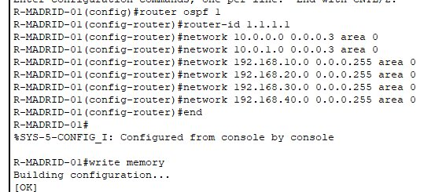

**R-MADRID-01:**
```cisco
router ospf 1
 router-id 1.1.1.1
 network 10.0.0.0 0.0.0.3 area 0
 network 10.0.1.0 0.0.0.3 area 0
 network 192.168.10.0 0.0.0.255 area 0
 network 192.168.20.0 0.0.0.255 area 0
 network 192.168.30.0 0.0.0.255 area 0
 network 192.168.40.0 0.0.0.255 area 0
```

**R-BCN-01:**
```cisco
router ospf 1
 router-id 2.2.2.2
 network 10.0.0.0 0.0.0.3 area 0
 network 10.0.2.0 0.0.0.3 area 0
 network 192.168.50.0 0.0.0.255 area 0
 network 192.168.60.0 0.0.0.255 area 0
 network 192.168.70.0 0.0.0.255 area 0
 network 192.168.80.0 0.0.0.255 area 0
```

**R-VLC-01:**
```cisco
router ospf 1
 router-id 3.3.3.3
 network 10.0.1.0 0.0.0.3 area 0
 network 10.0.2.0 0.0.0.3 area 0
 network 192.168.90.0 0.0.0.255 area 0
 network 192.168.100.0 0.0.0.255 area 0
 network 192.168.110.0 0.0.0.255 area 0
 network 192.168.120.0 0.0.0.255 area 0
```

### 3. Switches — VLANs, access y trunk

Aplicado en los 9 switches:

```cisco
vlan 10
 name Admin
vlan 20
 name Users
vlan 30
 name Servers
vlan 40
 name Guests
```

Trunk SW-CORE hacia router y switches de acceso:

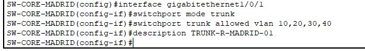

```cisco
interface GigabitEthernet1/0/1
 switchport mode trunk
 switchport trunk allowed vlan 10,20,30,40
 description TRUNK-ROUTER

interface GigabitEthernet1/0/2
 switchport mode trunk
 switchport trunk allowed vlan 10,20,30,40
 description TRUNK-SW-ACC-01

interface GigabitEthernet1/0/3
 switchport mode trunk
 switchport trunk allowed vlan 10,20,30,40
 description TRUNK-SW-ACC-02
```

Uplink trunk en todos los SW-ACC:
```cisco
interface GigabitEthernet1/0/24
 switchport mode trunk
 switchport trunk allowed vlan 10,20,30,40
 description TRUNK-SW-CORE
```

### 4. DHCP Centralizado y relay

El servidor DHCP en Madrid (192.168.30.10) sirve a todas las sedes. El `ip helper-address` en cada subinterfaz reenvía las solicitudes DHCP al servidor aunque estén en redes distintas.

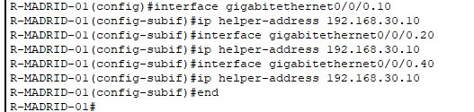

Aplicado en los 3 routers (excepto subinterfaz .30):
```cisco
interface GigabitEthernet0/0/0.10
 ip helper-address 192.168.30.10

interface GigabitEthernet0/0/0.20
 ip helper-address 192.168.30.10

interface GigabitEthernet0/0/0.40
 ip helper-address 192.168.30.10
```

Pools configurados en DHCP-SERVER (Services → DHCP):

| Pool | Gateway | DNS | Start IP | Máx. |
|---|---|---|---|---|
| MADRID-VLAN10 | 192.168.10.1 | 192.168.30.10 | 192.168.10.10 | 90 |
| MADRID-VLAN20 | 192.168.20.1 | 192.168.30.10 | 192.168.20.10 | 90 |
| MADRID-VLAN40 | 192.168.40.1 | 192.168.30.10 | 192.168.40.10 | 40 |
| BCN-VLAN10 | 192.168.50.1 | 192.168.30.10 | 192.168.50.10 | 90 |
| BCN-VLAN20 | 192.168.60.1 | 192.168.30.10 | 192.168.60.10 | 90 |
| BCN-VLAN40 | 192.168.80.1 | 192.168.30.10 | 192.168.80.10 | 40 |
| VLC-VLAN10 | 192.168.90.1 | 192.168.30.10 | 192.168.90.10 | 90 |
| VLC-VLAN20 | 192.168.100.1 | 192.168.30.10 | 192.168.100.10 | 90 |
| VLC-VLAN40 | 192.168.120.1 | 192.168.30.10 | 192.168.120.10 | 40 |

### 5. Port Security

Aplicado en todos los SW-ACC. Modo `restrict` para registrar violaciones sin interrumpir el servicio:

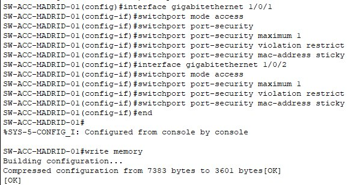

```cisco
interface GigabitEthernet1/0/1
 switchport mode access
 switchport port-security
 switchport port-security maximum 1
 switchport port-security violation restrict
 switchport port-security mac-address sticky

interface GigabitEthernet1/0/2
 switchport mode access
 switchport port-security
 switchport port-security maximum 1
 switchport port-security violation restrict
 switchport port-security mac-address sticky
```

---

## Verificación

### Vecinos OSPF — R-MADRID-01

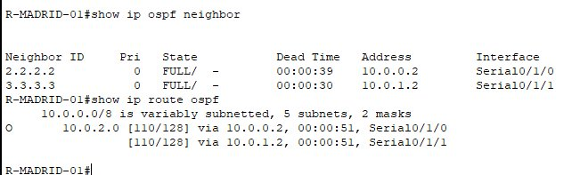

### Vecinos OSPF y rutas — R-VLC-01

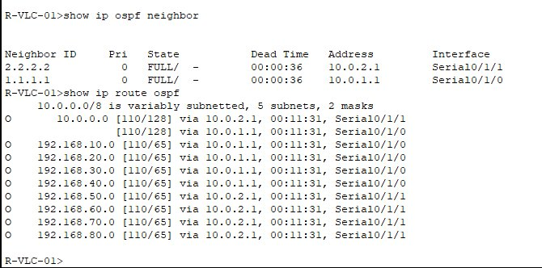

### Rutas OSPF — R-MADRID-01

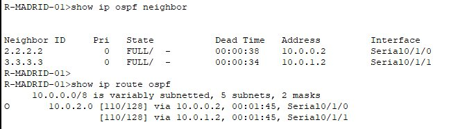

### Ping Madrid → Barcelona

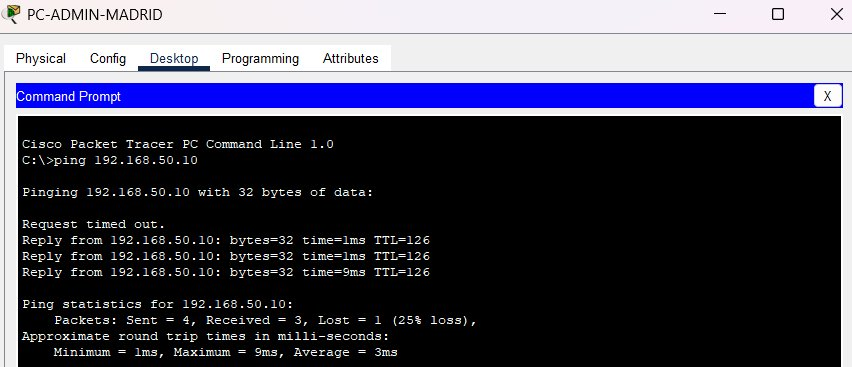

### Ping Barcelona → Madrid y Valencia

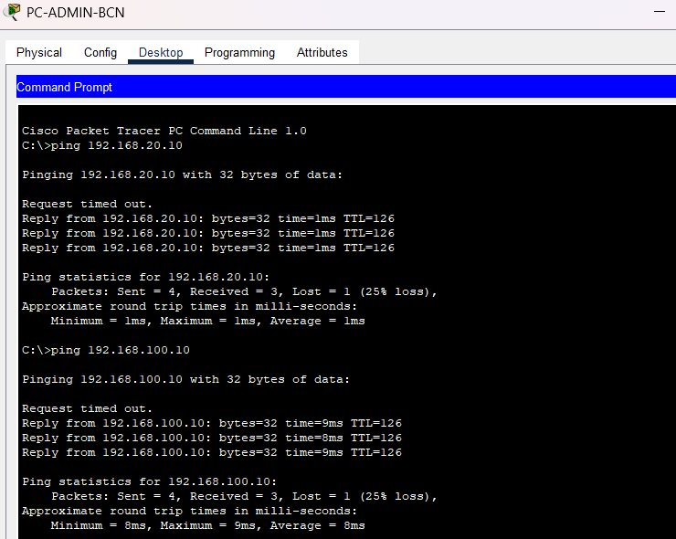

### Ping Valencia → Madrid y Barcelona

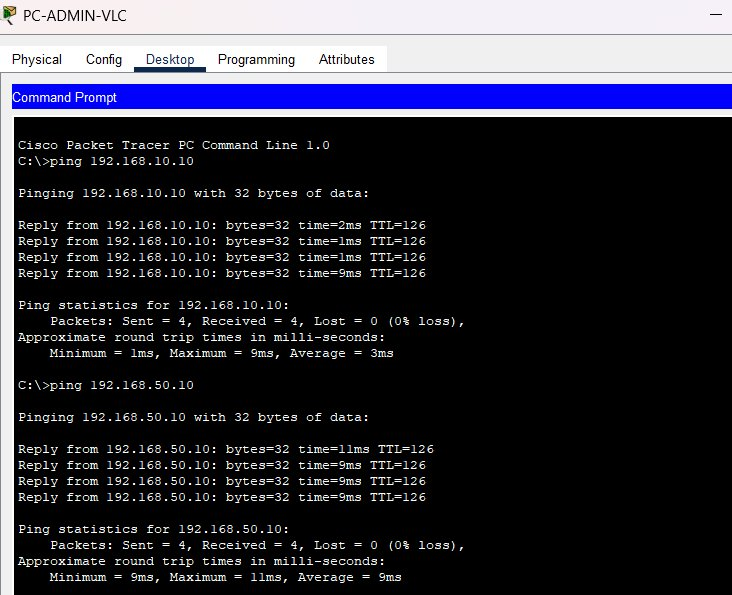

### Port Security

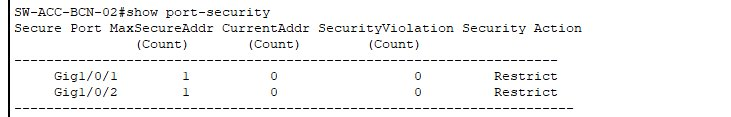

### Resultados esperados

| Prueba | Resultado |
|---|---|
| `show ip ospf neighbor` | FULL con los 2 vecinos en cada router |
| `show ip route ospf` | Rutas O de las otras 2 sedes |
| Ping inter-sede | Reply desde todas las sedes |
| DHCP por sede | IP correcta según pool de cada VLAN |
| `show port-security` | Secure-up, modo Restrict |

> El primer paquete perdido en los pings es normal — corresponde a la resolución ARP inicial.

---

## Problemas encontrados

**Problema:** Los enlaces Serial no levantaban.
**Causa:** Faltaba el comando `clock rate` en los extremos DCE.
**Solución:** Identificar los extremos DCE con `show controllers SerialX/X/X` y añadir `clock rate 64000`.

---

**Problema:** Los PCs de Barcelona y Valencia no recibían IP por DHCP.
**Causa:** El `ip helper-address` no estaba configurado en los routers remotos.
**Solución:** Añadir `ip helper-address 192.168.30.10` en las subinterfaces .10, .20 y .40 de R-BCN-01 y R-VLC-01. El relay funciona gracias a las rutas OSPF que permiten alcanzar el servidor en Madrid.

---

*Laboratorio realizado con Cisco Packet Tracer 8.x — Daniel Moisés Loyo Vásquez*
